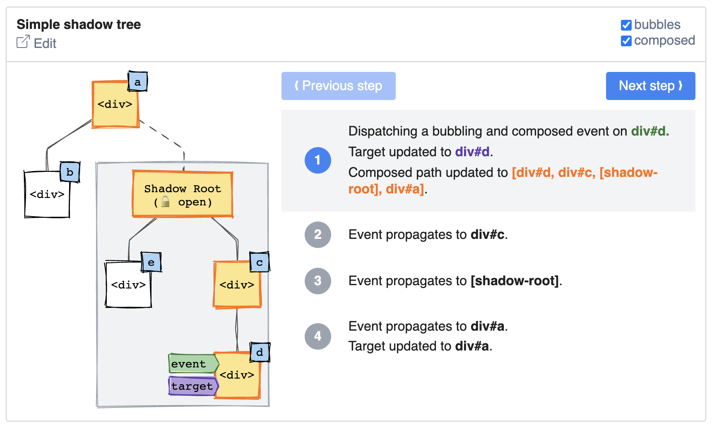

# Event visualizer

A visualization tool to better understand how events propagate in the shadow DOM.


## Overview

The way DOM events propagate in the shadow DOM is not intuitive for developers onboarding with web components. Event configuration, DOM structure and `closed` vs. `opened` shadow trees are many factors influencing event propagation.

This project is an attempt to bring clarity to this subject by offering a visual playground explaining how events propagates step-by-step in the shadow DOM.

[](https://codepen.io/pmdartus/pen/GRrWxQY?editors=1000)

**Try it out:** [Demo / Playground](https://codepen.io/pmdartus/pen/GRrWxQY?editors=1000)

## Installation

This package can be consumed as an NPM package.

```sh
$ npm install --save @pmdartus/event-visualizer
```

Alternatively for drop-in consumption this package can directly be loaded from [Skypack](https://www.skypack.dev/) CDN.

```html
<script type="module" src="https://cdn.skypack.dev/@pmdartus/event-visualizer"></script>
```

## `<event-visualizer>`

### Properties / Attributes

| Property        | Attribute        | Type      | Default | Description                                                                                                                         |
| --------------- | ---------------- | --------- | ------- | ----------------------------------------------------------------------------------------------------------------------------------- |
| `eventBubbles`  | `event-bubbles`  | `boolean` | `false` | Indicates wether the dispatched event should [bubbles](https://developer.mozilla.org/en-US/docs/Web/API/Event/bubbles) or not.      |
| `eventComposed` | `event-composed` | `boolean` | `false` | Indicates wether the dispatched event should be [composed](https://developer.mozilla.org/en-US/docs/Web/API/Event/composed) or not. |

### Slots

| Name     | Description                                                                                                                                                      |
| -------- | ---------------------------------------------------------------------------------------------------------------------------------------------------------------- |
| default  | Accepts a single `<template>` element representing the DOM tree to visualize. Refer to the [DOM tree definition](#dom-tree-definition) section for more details. |
| `footer` | Content to render in the footer.                                                                                                                                 |

## DOM tree definition

The visualized DOM tree is configured by passing a `<template>` element in the default slot. The content of the template tag is interpreted by the `<event-visualizer>` custom element to render the visual previous of the DOM tree and emulate event dispatching:

- Shadow trees can be defined directly in HTML via the [declarative shadow DOM syntax](https://github.com/mfreed7/declarative-shadow-dom).
- The original event target is defined by adding a `target` attribute.
- A label can be added to any element using the `id` attribute.
- Restrictions:
  - The template content should have root element.
  - The DOM should have a one element with the `target` attribute.

```html
<event-visualizer>
  <template>
    <div id="a">
      <div id="b" target></div>
    </div>
  </template>

  <div slot="footer">Simple tree</div>
</event-visualizer>

<event-visualizer>
  <template>
    <div id="a">
      <template shadowroot="open">
        <div id="b" target></div>
      </template>
      <div id="c">
    </div>
  </template>

  <div slot="footer">Simple shadow tree</div>
</event-visualizer>
```
